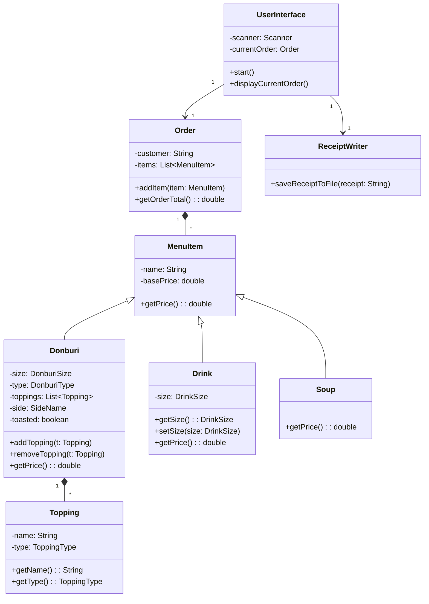

# NiceBowlShop: Don-Geon CLI POS

A robust Java Command-Line Interface (CLI) Point of Sale (POS) system designed to facilitate the creation and ordering of custom **Donburi** (Japanese rice bowls), along with drinks and soups. The system enforces complex business logic, such as tiered pricing for premium toppings, all within a clean, console-based user experience.

-----

## Table of Contents

1.  [Nice Bowl Shop](#1-Nice-Bowl-Shop)
2.  [Project Structure](#2-project-structure)
3.  [UML Diagram](#3-uml-diagram)
4.  [How to Run the Project](#4-how-to-run-the-project)
5.  [User Interface / Menu Examples](#5-user-interface--menu-examples)
6.  [Example Receipt Output](#6-example-receipt-output)
7.  [Interesting Code Snippet](#7-interesting-code-snippet)
8.  [Future Improvements](#8-future-improvements)

-----

## 1\. Nice Bowl Shop

This project, named **NiceBowlShop**, is a console application built purely in Java. It guides the user through the process of building a complex food order, primarily focusing on customizable Donburi bowls.

### Key Features

  * **Donburi Customization**: Allows selection of Donburi size (Small, Medium, Large) and type (e.g., Gyudon, Butadon).
  * **Tiered Topping System**: Toppings are categorized into **Premium** (paid), **Aroma Oil** (paid), **Regular** (free), **Sauce** (free), and **Side** (paid).
  * **Complex Pricing**: The first **Premium** topping and the first **Aroma Oil** are priced higher than subsequent ones, reflecting an add-on cost structure.
  * **Order Management**: Tracks all ordered items (Donburi, Drinks, Soups) and calculates a final order total.
  * **Receipt Generation**: Saves a detailed, timestamped receipt of the order to a file upon checkout.

-----

## 2\. Project Structure

The project follows a standard Maven structure, with the core application logic organized into distinct packages for models, UI, and utilities.

```
.
├── pom.xml
└── src
    └── main
        └── java
            └── com
                └── pluralsight
                    ├── NiceBowlShop.java           <-- Main Application Entry Point
                    ├── models                      <-- Data structures for menu items
                    │   ├── Donburi.java
                    │   ├── Drink.java
                    │   ├── MenuItem.java (Abstract Base Class)
                    │   ├── Order.java
                    │   ├── Soup.java
                    │   ├── Topping.java
                    │   └── enums                   <-- All Enums (Size, Type, Name)
                    ├── ui
                    │   └── UserInterface.java      <-- Handles all CLI interactions (I/O, menus)
                    └── util
                        └── ReceiptWriter.java      <-- File I/O for saving receipts
```

| Package/Class | Description |
| :--- | :--- |
| `com.pluralsight` | Contains the `NiceBowlShop` main class. |
| `models` | Holds the core data objects like `Order` and the inheritance hierarchy for `MenuItem` (`Donburi`, `Drink`, `Soup`). |
| `models.enums` | Defines all constants used in the system, such as `DonburiSize` (which also stores pricing tiers) and `ToppingItem`. |
| `ui` | Contains `UserInterface.java`, the class responsible for displaying menus, handling user input, and managing the order flow. |
| `util` | Contains `ReceiptWriter.java` for generating and saving the final receipt file. |

-----

## 3\. UML Diagram

This diagram illustrates the core class structure and relationships, highlighting the `MenuItem` inheritance and composition within the `Order` and `Donburi` classes.



-----

## 4\. How to Run the Project

Compile the code and run the class file in a terminal window (preferably bash, not IDE)

### Note on Console Clearing

The application uses the ANSI escape sequences (`\033[H\033[2J`) to clear the console for a cleaner interactive experience. This feature **may not work correctly** in some IDE integrated terminals (like IntelliJ) but functions as intended in standard operating system terminals (e.g., Windows Command Prompt, macOS/Linux Terminal).

-----

## 5\. User Interface / Menu Examples

The application's flow is managed entirely through text prompts.

### Main Menu

The starting screen for the application.

```
WELCOME TO THE DON-GEON
1) Start an Order
2) Exit

```

### Order Menu

The primary menu for adding items once an order is started.

```
Welcome, [Customer Name]
Current Order:
Your order is currently empty... Order some food!

ORDER MENU

1) ADD DONBURI
2) ADD DRINK
3) ADD SOUP
4) CHECKOUT

```

### Donburi Size Selector

```
PLEASE SELECT A DONBURI SIZE:

S) SMALL DON
M) MEDIUM DON
L) LARGE DON

X) NEVER MIND, GO BACK

```

### Topping Selector

Items marked with **[X]** are currently selected.

```
PREMIUM:
[ ]  1) Tamagoyaki
[X]  2) Marinated Egg
[ ]  3) Spicy Minced Pork
[ ]  4) Ground Beef
[ ]  5) Ikura
[ ]  6) Fried Egg

AROMA_OIL:
[X]  7) Chili Crisp Oil
[ ]  8) Ginger Scallion Oil
[ ]  9) Truffle Oil
[ ] 10) Black Garlic Oil
[ ] 11) Sesame Oil

REGULAR:
[ ] 12) Scallion
[ ] 13) Corn
...

Please input corresponding number to add/remove topping
OR
C) Confirm Toppings     X) Cancel Donburi Order
```

### Order Summary

A mock order for a Medium Gyudon, Large Beer, and Miso Soup.

```
Current Order:
        Donburis
                Gyudon(MEDIUM)($11.00)
                Toasted: true
                        Premium Toppings:
                                - (+$2.50) Marinated Egg
                        Aroma Oils:
                                - (+$0.75) Chili Crisp Oil
                                        Item Total: $14.25
        Drinks:
                BEER(LARGE)
                                        Item Total: $7.00
        Soup:
                MISO_SOUP:
                                        Item Total: $6.00
Order Total: $27.25
```

-----

## 6\. Example Receipt Output

When a user selects **CHECKOUT**, the final order summary is saved as a timestamped file in a `receipts/` directory (e.g., `20231114-173000.txt`).

```text
Receipt: 20231114-173000.txt
        Donburis
                Gyudon(MEDIUM)($11.00)
                Toasted: true
                        Premium Toppings:
                                - (+$2.50) Marinated Egg
                        Aroma Oils:
                                - (+$0.75) Chili Crisp Oil
                                        Item Total: $14.25
        Drinks:
                BEER(LARGE)
                                        Item Total: $7.00
        Soup:
                MISO_SOUP:
                                        Item Total: $6.00
Order Total: $27.25
```

-----

## 7\. Interesting Code Snippet

Interesting Code Snippet: Interactive Donburi Builder

This snippet showcases the donburiBuilder method, which lets users customize a Donburi bowl in real time via the CLI. Users can add or remove toppings, confirm or cancel the order, and see their selections updated dynamically. The code demonstrates robust input validation, category-based topping display, and clean separation of concerns by updating the Donburi object while keeping the builder logic focused on user interaction. It’s a simple but effective example of combining arrays, enums, and object-oriented principles to create an interactive terminal experience.

```java
private void donburiBuilder(DonburiSize size) {
        DonburiType donburiType = promptForDonburiType();
        Donburi currentDonburi = new Donburi(donburiType, size);

        boolean isRunning = true;
        Topping[] selectedToppings = new Topping[ToppingItem.values().length]; // keeps track of selected toppings
        while (isRunning) {
            clearScreen();

            displaySelectedToppings(selectedToppings);
            String responseStr = askUserStr("""
                    
                    Please input corresponding number to add/remove topping
                    OR
                    C) Confirm Toppings     X) Cancel Donburi Order
                    """);

```
```java

            int indexOfTopping;
            try {
                indexOfTopping = Integer.parseInt(responseStr) - 1;
            } catch (NumberFormatException e) {
                System.out.println("Invalid input: please enter a valid number, C, or X.");
                pause(2000); // give user time to read error before it automatically clears at the start of the loop
                continue;
            }

            if (indexOfTopping < 0 || indexOfTopping >= selectedToppings.length) {
                System.out.println("Invalid number: please choose a topping number from the menu.");
                pause(2000);
                continue;
            }

            if (selectedToppings[indexOfTopping] != null) {
                Topping existingTopping = selectedToppings[indexOfTopping];
                currentDonburi.removeTopping(existingTopping); // remove from Donburi object
                selectedToppings[indexOfTopping] = null; // remove from array (for display accuracy)
            } else {
                ToppingItem toppingItem = ToppingItem.values()[indexOfTopping];
                Topping newTopping = new Topping(toppingItem, toppingItem.getType());
                selectedToppings[indexOfTopping] = newTopping; // add to array (for display accuracy)
                currentDonburi.addTopping(newTopping); // add to Donburi object
            }

        }
    }

```
```java
    // display selected toppings from array
    private static void displaySelectedToppings(Topping[] selectedToppings) {
        int displayIndex = 1;
        // loop through ToppingType values to get headers above each list of topping categories
        for (ToppingType type : ToppingType.values()) {
            System.out.println(type.name() + ":");

            // for each topping type, list toppings below
            for (ToppingItem toppingItem : ToppingItem.values()) {
                if (toppingItem.getType() == type) {
                    System.out.printf("[%s] %2d) %s%n",
                            (selectedToppings[displayIndex - 1] != null) ? "X" : " ",
                            displayIndex,
                            toppingItem.getDisplayName()
                    );
                    displayIndex++;
                }
            }
        }
    }
```

-----

## 8\. Future Improvements

  * **Order Modification**: Implement functionality to remove individual items from the current order list.
  * **Discount/Coupons**: Add logic to apply a fixed-amount or percentage discount to the order total.
  * **Detailed Topping Pricing**: Display the cost of paid toppings directly in the topping selection menu.
  * **Inventory/Stock**: Introduce an inventory system to track ingredient stock.
  * **GUI**: Cereate an interactive GUI with JavaFX
