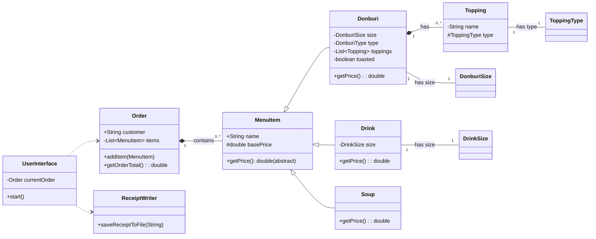

# NiceBowlShop: Don-Geon CLI POS

A robust Java Command-Line Interface (CLI) Point of Sale (POS) system designed to facilitate the creation and ordering of custom **Donburi** (Japanese rice bowls), along with drinks and soups. The system enforces complex business logic, such as tiered pricing for premium toppings, all within a clean, console-based user experience.

-----

## Table of Contents

1.  [Nice Bowl Shop](#1-Nice-Bowl-Shop)
2.  [Project Structure](#2-project-structure)
3.  [UML Diagram](#3-uml-diagram)
4.  [How to Run the Project](#4-how-to-run-the-project)
5.  [User Interface / Menu Examples](#5-user-interface--menu-examples)
6.  [Example Receipt Output](#6-example-receipt-output)
7.  [Interesting Code Snippet](#7-interesting-code-snippet)
8.  [Future Improvements](#8-future-improvements)

-----

## 1\. Nice Bowl Shop

This project, named **NiceBowlShop**, is a console application built purely in Java. It guides the user through the process of building a complex food order, primarily focusing on customizable Donburi bowls.

### Key Features

  * **Donburi Customization**: Allows selection of Donburi size (Small, Medium, Large) and type (e.g., Gyudon, Butadon).
  * **Tiered Topping System**: Toppings are categorized into **Premium** (paid), **Aroma Oil** (paid), **Regular** (free), **Sauce** (free), and **Side** (paid).
  * **Complex Pricing**: The first **Premium** topping and the first **Aroma Oil** are priced higher than subsequent ones, reflecting an add-on cost structure.
  * **Order Management**: Tracks all ordered items (Donburi, Drinks, Soups) and calculates a final order total.
  * **Receipt Generation**: Saves a detailed, timestamped receipt of the order to a file upon checkout.

-----

## 2\. Project Structure

The project follows a standard Maven structure, with the core application logic organized into distinct packages for models, UI, and utilities.

```
.
├── pom.xml
└── src
    └── main
        └── java
            └── com
                └── pluralsight
                    ├── NiceBowlShop.java           <-- Main Application Entry Point
                    ├── models                      <-- Data structures for menu items
                    │   ├── Donburi.java
                    │   ├── Drink.java
                    │   ├── MenuItem.java (Abstract Base Class)
                    │   ├── Order.java
                    │   ├── Soup.java
                    │   ├── Topping.java
                    │   └── enums                   <-- All Enums (Size, Type, Name)
                    ├── ui
                    │   └── UserInterface.java      <-- Handles all CLI interactions (I/O, menus)
                    └── util
                        └── ReceiptWriter.java      <-- File I/O for saving receipts
```

| Package/Class | Description |
| :--- | :--- |
| `com.pluralsight` | Contains the `NiceBowlShop` main class. |
| `models` | Holds the core data objects like `Order` and the inheritance hierarchy for `MenuItem` (`Donburi`, `Drink`, `Soup`). |
| `models.enums` | Defines all constants used in the system, such as `DonburiSize` (which also stores pricing tiers) and `ToppingItem`. |
| `ui` | Contains `UserInterface.java`, the class responsible for displaying menus, handling user input, and managing the order flow. |
| `util` | Contains `ReceiptWriter.java` for generating and saving the final receipt file. |

-----

## 3\. UML Diagram

This diagram illustrates the core class structure and relationships, highlighting the `MenuItem` inheritance and composition within the `Order` and `Donburi` classes.



-----

## 4\. How to Run the Project

The project can be compiled and run from a terminal using standard Java commands (requires **Java 17** or newer, as specified in `pom.xml`).

### Compilation

From the project root directory, run the following command to compile all source files:

```bash
# Compile all .java files into their respective class files
javac src/main/java/com/pluralsight/**/*.java
```

### Execution

Run the main class, ensuring the compiled classes are on the classpath:

```bash
# Execute the main class
java -cp src/main/java com.pluralsight.NiceBowlShop
```

### Note on Console Clearing

The application uses the ANSI escape sequences (`\033[H\033[2J`) to clear the console for a cleaner interactive experience. This feature **may not work correctly** in some IDE integrated terminals (like IntelliJ) but functions as intended in standard operating system terminals (e.g., Windows Command Prompt, macOS/Linux Terminal).

-----

## 5\. User Interface / Menu Examples

The application's flow is managed entirely through text prompts.

### Main Menu

The starting screen for the application.

```
WELCOME TO THE DON-GEON
1) Start an Order
2) Exit

```

### Order Menu

The primary menu for adding items once an order is started.

```
Welcome, [Customer Name]
Current Order:
Your order is currently empty... Order some food!

ORDER MENU

1) ADD DONBURI
2) ADD DRINK
3) ADD SOUP
4) CHECKOUT

```

### Donburi Size Selector

```
PLEASE SELECT A DONBURI SIZE:

S) SMALL DON
M) MEDIUM DON
L) LARGE DON

X) NEVER MIND, GO BACK

```

### Topping Selector

Items marked with **[X]** are currently selected.

```
PREMIUM:
[ ]  1) Tamagoyaki
[X]  2) Marinated Egg
[ ]  3) Spicy Minced Pork
[ ]  4) Ground Beef
[ ]  5) Ikura
[ ]  6) Fried Egg

AROMA_OIL:
[X]  7) Chili Crisp Oil
[ ]  8) Ginger Scallion Oil
[ ]  9) Truffle Oil
[ ] 10) Black Garlic Oil
[ ] 11) Sesame Oil

REGULAR:
[ ] 12) Scallion
[ ] 13) Corn
...

Please input corresponding number to add/remove topping
OR
C) Confirm Toppings     X) Cancel Donburi Order
```

### Order Summary

A mock order for a Medium Gyudon, Large Beer, and Miso Soup.

```
Current Order:
        Donburis
                Gyudon(MEDIUM)($11.00)
                Toasted: true
                        Premium Toppings:
                                - (+$2.50) Marinated Egg
                        Aroma Oils:
                                - (+$0.75) Chili Crisp Oil
                                        Item Total: $14.25
        Drinks:
                BEER(LARGE)
                                        Item Total: $7.00
        Soup:
                MISO_SOUP:
                                        Item Total: $6.00
Order Total: $27.25
```

-----

## 6\. Example Receipt Output

When a user selects **CHECKOUT**, the final order summary is saved as a timestamped file in a `receipts/` directory (e.g., `20231114-173000.txt`).

```text
Receipt: 20231114-173000.txt
        Donburis
                Gyudon(MEDIUM)($11.00)
                Toasted: true
                        Premium Toppings:
                                - (+$2.50) Marinated Egg
                        Aroma Oils:
                                - (+$0.75) Chili Crisp Oil
                                        Item Total: $14.25
        Drinks:
                BEER(LARGE)
                                        Item Total: $7.00
        Soup:
                MISO_SOUP:
                                        Item Total: $6.00
Order Total: $27.25
```

-----

## 7\. Interesting Code Snippet

The `Donburi.getPrice()` method showcases the complex business logic for tiered topping pricing, where the first premium/aroma oil item costs one price, and subsequent items of the same type cost a reduced amount. This logic is crucial for modeling a typical POS system's add-on charges.

```java
// src/main/java/com/pluralsight/models/Donburi.java
@Override
public double getPrice() {
    double currentPrice = this.basePrice;
    int premiumCount = this.getListOfPremiumToppings().size();
    int aromaCount = this.getListOfAromaOils().size();

    // The first premium topping costs size.getFirstPrem(), subsequent toppings cost size.getExtraPrem().
    if (premiumCount > 0) {
        currentPrice += size.getFirstPrem() + (premiumCount - 1) * size.getExtraPrem();
    }

    // The first aroma oil costs size.getFirstOil(), subsequent oils cost size.getExtraOil().
    if (aromaCount > 0) {
        currentPrice += size.getFirstOil() + (aromaCount - 1) * size.getExtraOil();
    }

    return currentPrice;
}
```

-----

## 8\. Future Improvements

  * **Order Modification**: Implement functionality to remove individual items from the current order list.
  * **Discount/Coupons**: Add logic to apply a fixed-amount or percentage discount to the order total.
  * **Data Persistence**: Save orders to a persistent storage (e.g., CSV file or simple database) instead of just generating a one-time receipt, allowing for history tracking.
  * **Detailed Topping Pricing**: Display the cost of paid toppings directly in the topping selection menu.
  * **Inventory/Stock**: Introduce an inventory system to track ingredient stock.
